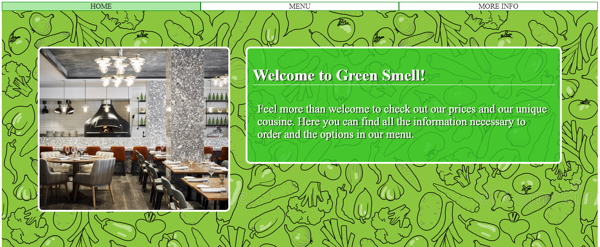

# Restaurant_page

> This project consists of developing a restaurant page using the recently acquired knowledge in webpack. Using mostly Javascript, I was able to insert elemnts and features. The project is made of different modules using webpack. 



## Built With
- HTML & CSS
- JavaScript/ES6
- Webpack
- eslint
- style lint

## Live Demo

> [LiveDemoLink]() 

## Getting Started

To get a local copy up and running follow these simple example steps.

```
git clone https://github.com/karthykarthick/RESTAURANT-PAGE.git
Open the index.html
Explore the website
```

## Author

👤 **Karthick Harimoorthy**

- Github: [@karthick](https://github.com/karthykarthick)
- LinkedIn: [Alexandre Bouhid](https://www.linkedin.com/in/karthick-harimoorthy/)

## 🤝 Contributing

Contributions, issues and feature requests are welcome!

## Show your support

Give a ⭐️ if you like this project!

## 📝 License

This project is [MIT](lic.url) licensed.